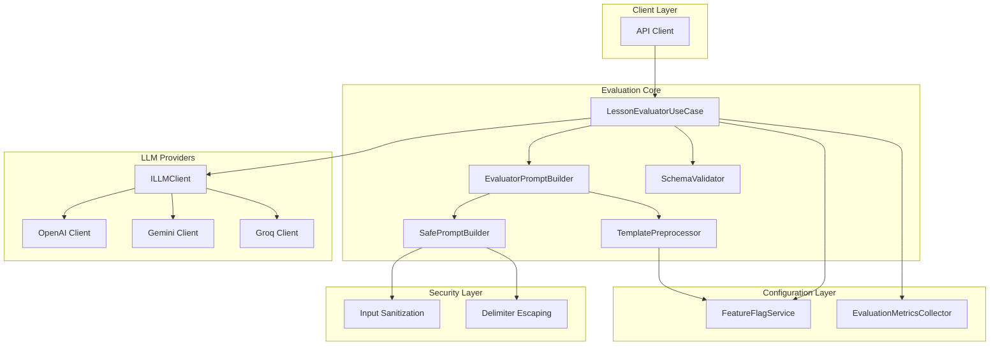

# Evaluation Engine Documentation

## Table of Contents

1. [Overview](#overview)
2. [Architecture](#architecture)
3. [Components](#components)
   - [ILLMClient](#illmclient)
   - [SchemaValidator](#schemavalidator)
   - [SafePromptBuilder](#safepromptbuilder)
   - [TemplatePreprocessor](#templatepreprocessor)
   - [EvaluatorPromptBuilder](#evaluatorpromptbuilder)
   - [LessonEvaluatorUseCase](#lessonevaluatorusecase)
   - [FeatureFlagService](#featureflagservice)
   - [EvaluationMetricsCollector](#evaluationmetricscollector)
   - [StagingValidation](#stagingvalidation)
4. [Teacher Rubric Configuration](#teacher-rubric-configuration)
   - [Basic Configuration](#basic-configuration)
   - [Exemplars Configuration](#exemplars-configuration)
5. [Conditional Templates](#conditional-templates)
   - [Syntax Reference](#syntax-reference)
   - [Truthy/Falsy Rules](#truthyfalsy-rules)
   - [Examples](#conditional-template-examples)
6. [Using the Evaluation API](#using-the-evaluation-api)
7. [Security Features](#security-features)
8. [Error Handling](#error-handling)
9. [Performance Characteristics](#performance-characteristics)
10. [Cohort-Based Rollout](#cohort-based-rollout)
    - [Assignment Strategies](#assignment-strategies)
    - [Configuration Examples](#cohort-configuration-examples)
11. [Monitoring & Metrics](#monitoring--metrics)
    - [Metrics Collected](#metrics-collected)
    - [Accessing Metrics](#accessing-metrics)
    - [Log Patterns](#log-patterns)
12. [Staging Validation](#staging-validation)
    - [Enabling in Staging](#enabling-in-staging)
    - [What Logs to Look For](#what-logs-to-look-for)
13. [Feature Flags Reference](#feature-flags-reference)
14. [Testing Guidelines](#testing-guidelines)
    - [Unit Tests](#unit-tests)
    - [Integration Tests](#integration-tests)
    - [New Test Scenarios](#new-test-scenarios)
15. [Troubleshooting](#troubleshooting)
    - [Common Issues](#common-issues)
    - [Debug Tips](#debug-tips)
16. [Migration Guide](#migration-guide)
    - [From Legacy System](#from-legacy-system)
    - [New Features Guide](#new-features-guide)
17. [Configuration Options](#configuration-options)
18. [Known Limitations](#known-limitations)
19. [Future Improvements](#future-improvements)
20. [Related Documentation](#related-documentation)

---

## Overview

The Evaluation Engine is a modular LLM-based system for rubric-based student answer assessment in the Pixel Mentor educational platform. It provides:

- **Conceptual evaluation**: Evaluates student understanding, not just keyword matching
- **Positive feedback**: Always returns constructive, encouraging feedback
- **Flexible rubric**: Teachers can configure keywords, central truth, and exemplars
- **Conditional templates**: Dynamic prompt construction based on context
- **Cohort-based rollout**: Gradual deployment with feature flags
- **Security**: Built-in prompt injection prevention
- **Reliability**: Retry logic with graceful fallback on errors
- **Comprehensive monitoring**: Metrics collection and structured logging

### When to Use

Use the Evaluation Engine when you need to:

- Assess student answers against a configurable rubric
- Provide personalized feedback based on lesson context
- Integrate with any LLM provider (OpenAI, Gemini, Groq, etc.)
- Gradually roll out new evaluation features to specific user groups

---

## Architecture



### Design Principles

1. **Single Responsibility**: Each component does one thing well
2. **Open/Closed**: Extend via interfaces, not modification
3. **Dependency Inversion**: Depend on abstractions, not implementations
4. **Fail Gracefully**: Always return valid feedback, never crash
5. **Security First**: All user input is treated as untrusted

---

## Components

### ILLMClient

The `ILLMClient` interface defines the contract for LLM communication. It provides a unified API regardless of the underlying provider.

**File**: `apps/api/src/llm/client.interface.ts`

```typescript
import type { ILLMClient, LLMExecutionOptions } from '@/llm/client.interface';

interface LLMExecutionOptions {
  /** Maximum retry attempts */
  maxAttempts?: number;
  /** Timeout in milliseconds */
  timeoutMs?: number;
  /** Backoff strategy */
  backoffStrategy?: 'exponential' | 'linear' | 'fixed';
  /** Backoff multiplier */
  backoffFactor?: number;
}

interface ILLMClient {
  executePrompt(prompt: string, options?: LLMExecutionOptions): Promise<string>;
}
```

**Implementation Example**:

```typescript
import { OpenAIClient, createOpenAIClient } from '@/llm';

const client = createOpenAIClient({
  apiKey: process.env.OPENAI_API_KEY,
  model: 'gpt-4o',
});

const response = await client.executePrompt('Explain photosynthesis in simple terms', {
  maxAttempts: 3,
  timeoutMs: 15000,
});
```

---

### SchemaValidator

The `SchemaValidator` provides robust validation for LLM responses using Zod schemas. It handles edge cases like markdown-wrapped JSON and empty responses.

**File**: `apps/api/src/validation/schema.validator.ts`

```typescript
import { SchemaValidator, SchemaValidationError } from '@/validation/schema.validator';
import { z } from 'zod';

// Define your response schema
const MyResponseSchema = z.object({
  outcome: z.enum(['correct', 'partial', 'incorrect']),
  score: z.number().min(0).max(10),
  feedback: z.string(),
  confidence: z.number().min(0).max(1).optional(),
});

// Validate LLM response
const validator = new SchemaValidator();
const result = validator.validate(rawLLMResponse, MyResponseSchema);
```

**Features**:

- Parses markdown-wrapped JSON (`json ... `)
- Handles empty/whitespace responses
- Provides detailed error messages
- Supports safe validation without throwing

---

### SafePromptBuilder

The `SafePromptBuilder` constructs prompts by wrapping untrusted values in XML-style delimiters to prevent prompt injection attacks.

**File**: `apps/api/src/prompt/safe.prompt.builder.ts`

```typescript
import { SafePromptBuilder, buildSafePrompt } from '@/prompt';

// Example 1: Using the builder
const builder = new SafePromptBuilder();
const prompt = builder
  .setTemplate('Student said: {{answer}}. Question: {{question}}')
  .setValues({
    answer: 'The answer with </student_input> injection',
    question: 'What is photosynthesis?',
  })
  .build();

// Result: Student said: <student_input>The answer with &lt;/student_input&gt; injection</student_input>...

// Example 2: Using factory function
const prompt2 = buildSafePrompt('{{name}} answered: {{answer}}', {
  name: 'Maria',
  answer: 'I think </script>',
});
```

**Security Model**:

- All placeholder values are treated as UNTRUSTED
- Values are wrapped in `<student_input>...</student_input>` delimiters
- Delimiter occurrences within values are HTML-entity escaped
- Prevents premature tag closure and nested injection attacks

---

### TemplatePreprocessor

The `TemplatePreprocessor` processes template strings with conditional blocks (`{{#if}}`, `{{#unless}}`) and variable placeholders. It enables dynamic prompt construction based on context values.

**File**: `apps/api/src/prompt/template.preprocessor.ts`

```typescript
import { TemplatePreprocessor, createTemplatePreprocessor } from '@/prompt';

const processor = new TemplatePreprocessor();

// Basic conditional
const result = processor.process('{{#if isLoggedIn}}Welcome {{name}}{{/if}}', {
  isLoggedIn: true,
  name: 'Alice',
});
// Result: 'Welcome Alice'

// Unless conditional
const result2 = processor.process('{{#unless isPremium}}Upgrade to premium!{{/unless}}', {
  isPremium: false,
});
// Result: 'Upgrade to premium!'

// Multiple conditionals
const template = `
{{#if hasExemplars}}
Examples:
{{exemplars}}
{{/if}}
{{#if studentName}}
Student: {{studentName}}
{{/if}}
`;

const result3 = processor.process(template, {
  hasExemplars: true,
  exemplars: 'Example 1\nExample 2',
  studentName: 'Maria',
});
```

**Features**:

- Supports `{{#if variableName}}...{{/if}}` blocks
- Supports `{{#unless variableName}}...{{/unless}}` blocks
- Nested conditionals up to 5 levels deep
- Handles truthy/falsy evaluation of values
- Non-student-input placeholders are replaced during preprocessing

**Security Note**: TemplatePreprocessor does NOT perform delimiter escaping. That is `SafePromptBuilder`'s responsibility. Use `EvaluatorPromptBuilder` to combine both safely.

---

### EvaluatorPromptBuilder

The `EvaluatorPromptBuilder` combines `TemplatePreprocessor` and `SafePromptBuilder` to produce safe evaluation prompts with conditional logic.

**File**: `apps/api/src/prompt/evaluator.prompt.builder.ts`

```typescript
import { EvaluatorPromptBuilder, createEvaluatorPromptBuilder } from '@/prompt';

// Create with default components
const builder = createEvaluatorPromptBuilder();

// Build a safe prompt with conditionals
const result = builder.build(
  `{{#if exemplars}}
Examples:
{{exemplars}}
{{/if}}
Evaluate: {{studentAnswer}}`,
  {
    exemplars: 'Example correct answer',
    studentAnswer: '<script>alert("xss")</script>',
  },
);
// The exemplars placeholder is replaced
// The studentAnswer is wrapped in <student_input> delimiters with escaping
```

**Process**:

1. Extract student answer value from context
2. Replace `{{studentAnswer}}` with a unique sentinel
3. Preprocess template (expand conditionals, replace other placeholders)
4. Restore `{{studentAnswer}}` placeholder
5. Build safe prompt with student answer wrapped in delimiters

---

### LessonEvaluatorUseCase

The `LessonEvaluatorUseCase` orchestrates the complete evaluation workflow, from building prompts to returning structured results.

**File**: `apps/api/src/evaluator/lesson.evaluator.ts`

```typescript
import {
  LessonEvaluatorUseCase,
  createLessonEvaluator,
  type EvaluationRequest,
  type EvaluationResult,
} from '@/evaluator';

// Create evaluator with dependencies
const evaluator = createLessonEvaluator(llmClient);

// Or manually inject dependencies
const evaluator = new LessonEvaluatorUseCase(
  llmClient,
  new SafePromptBuilder(),
  new SchemaValidator<EvaluationResponse>(),
);

// Evaluate a student answer
const request: EvaluationRequest = {
  studentAnswer: 'La fotosíntesis es el proceso por el cual las plantas...',
  questionText: '¿Qué es la fotosíntesis?',
  teacherConfig: {
    centralTruth:
      'La fotosíntesis es el proceso por el cual las plantas convierten luz solar en energía...',
    requiredKeywords: ['clorofila', 'luz solar', 'dióxido de carbono'],
    maxScore: 10,
  },
  lessonContext: {
    subject: 'Ciencias Naturales',
    gradeLevel: '6to grado',
    topic: 'Fotosíntesis',
  },
  studentProfile: {
    name: 'María',
    learningStyle: 'visual',
  },
};

const result: EvaluationResult = await evaluator.evaluate(request);

console.log(result);
// {
//   outcome: 'correct',
//   score: 9,
//   feedback: '¡Excelente trabajo! Tu respuesta demuestra una comprensión clara...',
//   confidence: 0.95
// }
```

---

### FeatureFlagService

The `FeatureFlagService` manages cohort-based rollout configuration for the evaluation engine.

**File**: `apps/api/src/config/evaluation-flags.ts`

```typescript
import { featureFlagService, getFeatureFlagService } from '@/config';

// Check if new engine should be used
const useNewEngine = featureFlagService.instance.shouldUseNewEngine('beta-users');

// Check specific flags
if (featureFlagService.instance.isConditionalTemplatesEnabled()) {
  // Apply template preprocessing with conditionals
}

if (featureFlagService.instance.isKeywordExtractionEnabled()) {
  // Auto-extract keywords when not provided
}

// Get cohort-specific config
const cohortConfig = featureFlagService.instance.getCohortConfig('beta-users');
if (cohortConfig?.evaluatorType === 'llm') {
  const model = cohortConfig.parameters?.modelName;
  // Use specific model for this cohort
}

// Get all configured cohorts
const cohorts = featureFlagService.instance.getCohorts();
```

**Loading Order**:

1. Environment variable `EVALUATION_FLAGS` (JSON string)
2. Config file `config/evaluation-flags.json`
3. Default values

---

### EvaluationMetricsCollector

The `EvaluationMetricsCollector` provides comprehensive metrics tracking for the evaluation engine.

**File**: `apps/api/src/monitoring/eval-metrics.ts`

```typescript
import {
  EvaluationMetricsCollector,
  EvaluationTimer,
  getMetricsStore,
  getMetricsSummary,
} from '@/monitoring/eval-metrics';

// Collect metrics during evaluation
const collector = new EvaluationMetricsCollector();
const complete = collector.startEvaluation('new', 'beta-50');

// ... perform evaluation ...

// Complete with outcome
complete('correct');

// Or record directly
const timer = new EvaluationTimer();
const result = await evaluator.evaluate(request);
const latency = timer.getElapsed();

collector.recordCompletion('new', result.outcome, latency, 'beta-50');

// Get metrics snapshot
const metrics = getMetricsStore().getMetrics();

// Get human-readable summary
const summary = getMetricsSummary();
```

---

### StagingValidation

The `StagingValidation` module provides staging-specific validation and configuration checks.

**File**: `apps/api/src/monitoring/staging-validation.ts`

```typescript
import { runStagingValidation, getEvaluationHealthCheck } from '@/monitoring/staging-validation';
import { featureFlagService } from '@/config';

// Run validation at startup
const isValid = runStagingValidation(featureFlagService.instance);

// Check health
const health = getEvaluationHealthCheck(featureFlagService.instance);
console.log(health);
// {
//   healthy: true,
//   engineActive: true,
//   useNewEngine: true,
//   configuredCohorts: ['alpha-10', 'beta-50'],
//   warnings: []
// }
```

---

## Teacher Rubric Configuration

The `TeacherConfig` interface allows teachers to define evaluation criteria.

### Basic Configuration

```typescript
interface TeacherConfig {
  /** The central truth/correct answer */
  centralTruth: string;

  /** Required keywords (case-insensitive). Can be auto-extracted if not provided. */
  requiredKeywords: readonly string[];

  /** Optional exemplars for calibration */
  exemplars?: {
    correct: string[]; // Example correct answers
    partial: string[]; // Example partial answers
    incorrect: string[]; // Example incorrect answers
  };

  /** Maximum score (default: 10) */
  maxScore?: number;
}
```

**Basic Rubric (keywords only)**:

```typescript
const basicRubric: TeacherConfig = {
  centralTruth: 'La mitosis es el proceso de división celular...',
  requiredKeywords: ['célula', 'cromosomas', 'división'],
  maxScore: 10,
};
```

### Exemplars Configuration

Exemplars are example answers that help calibrate the LLM's evaluation criteria. They demonstrate what constitutes correct, partial, and incorrect responses.

```typescript
const advancedRubric: TeacherConfig = {
  centralTruth: 'El ciclo del agua describe cómo el agua se mueve...',
  requiredKeywords: ['evaporación', 'condensación', 'precipitación', 'colección'],
  exemplars: {
    correct: [
      'El ciclo del agua incluye evaporación, condensación y precipitación.',
      'El agua se evapora del océano, forma nubes y vuelve como lluvia.',
    ],
    partial: ['El agua va del cielo a la tierra.', 'Hay evaporación y lluvia en el ciclo.'],
    incorrect: ['El ciclo del agua solo tiene evaporación.', 'El agua no cambia de lugar.'],
  },
  maxScore: 10,
};
```

**Best Practices for Exemplars**:

1. **数量**: Provide 2-3 examples per category (correct, partial, incorrect)
2. **多样性**: Include varied examples that show the range of expected answers
3. **清晰性**: Ensure examples clearly demonstrate the distinction between categories
4. **语言**: Use language appropriate to the student's grade level
5. **顺序**: Start with the most representative example

---

## Conditional Templates

Conditional templates enable dynamic prompt construction based on the evaluation context. This allows prompts to include or exclude sections based on the presence of data.

### Syntax Reference

| Syntax                               | Description                          |
| ------------------------------------ | ------------------------------------ |
| `{{#if variable}}...{{/if}}`         | Includes block if variable is truthy |
| `{{#unless variable}}...{{/unless}}` | Includes block if variable is falsy  |
| `{{variableName}}`                   | Replaced with value from context     |

### Truthy/Falsy Rules

| Type      | Truthy                       | Falsy         |
| --------- | ---------------------------- | ------------- |
| String    | Non-empty (`"hello"`, `" "`) | Empty (`""`)  |
| Number    | `> 0`                        | `0`, negative |
| Boolean   | `true`                       | `false`       |
| Array     | Non-empty                    | Empty `[]`    |
| Object    | Non-empty                    | Empty `{}`    |
| null      | -                            | `null`        |
| undefined | -                            | `undefined`   |

### Conditional Template Examples

**Basic Conditional**:

```handlebars
{{#if hasExemplars}}
  Examples:
  {{exemplars}}
{{/if}}
```

**Unless Conditional**:

```handlebars
{{#unless hasKeywords}}
  Nota: No se especificaron palabras clave.
{{/unless}}
```

**Nested Conditionals**:

```handlebars
{{#if isLoggedIn}}
  {{#if isPremium}}
    Premium feedback:
    {{premiumContent}}
  {{else}}
    Standard feedback:
    {{standardContent}}
  {{/if}}
{{/if}}
```

**Multiple Conditions**:

```handlebars
{{#if exemplars}}
  ### Ejemplos de Respuestas
  {{exemplars}}
{{/if}}

{{#if studentName}}
  **Estudiante**:
  {{studentName}}
{{/if}}

{{#unless requiredKeywords}}
  *Nota: Este ejercicio no requiere palabras clave específicas.*
{{/unless}}
```

**Used in Evaluation Prompts**:

```typescript
const template = `
PREGUNTA:
{{questionText}}

RESPUESTA DEL ESTUDIANTE:
{{studentAnswer}}

{{#if exemplars}}
EJEMPLOS DE REFERENCIA:
{{exemplars}}
{{/if}}

{{#if requiredKeywords}}
PALABRAS CLAVE: {{requiredKeywords}}
{{/if}}

RÚBRICA:
{{centralTruth}}
`;

const result = processor.process(template, {
  questionText: '¿Qué es la fotosíntesis?',
  studentAnswer: 'La respuesta del estudiante...',
  exemplars: 'Correct: "La fotosíntesis..."',
  requiredKeywords: 'clorofila, luz solar',
  centralTruth: 'La verdad central es...',
});
```

---

## Using the Evaluation API

### Request Format

```typescript
interface EvaluationRequest {
  /** Student's submitted answer */
  studentAnswer: string;

  /** Original question */
  questionText: string;

  /** Teacher's rubric */
  teacherConfig: TeacherConfig;

  /** Lesson context */
  lessonContext: {
    subject: string;
    gradeLevel: string;
    topic: string;
  };

  /** Optional student profile */
  studentProfile?: {
    name?: string;
    learningStyle?: 'visual' | 'auditory' | 'kinesthetic' | 'reading';
  };
}
```

### Response Format

```typescript
interface EvaluationResult {
  /** Classification: 'correct' | 'partial' | 'incorrect' */
  outcome: 'correct' | 'partial' | 'incorrect';

  /** Numeric score (0 to maxScore) */
  score: number;

  /** Constructive feedback for student */
  feedback: string;

  /** Optional improvement suggestion */
  improvementSuggestion?: string;

  /** Confidence level (0-1) */
  confidence: number;
}
```

### Example API Call

```typescript
// Via LessonEvaluatorUseCase
const result = await evaluator.evaluate({
  studentAnswer: 'La fotosíntesis ocurre en las hojas de las plantas...',
  questionText: '¿Dónde ocurre la fotosíntesis?',
  teacherConfig: {
    centralTruth: 'La fotosíntesis ocurre en las células de las hojas...',
    requiredKeywords: ['cloroplastos', 'hojas', 'luz'],
  },
  lessonContext: {
    subject: 'Ciencias',
    gradeLevel: '6to',
    topic: 'Plantas'
  }
});

// Result
{
  outcome: 'partial',
  score: 6.5,
  feedback: '¡Buen esfuerzo! Mencionaste que ocurre en las hojas, lo cual es correcto...',
  improvementSuggestion: 'Intenta incluir más detalles sobre el papel de la luz solar.',
  confidence: 0.8
}
```

---

## Security Features

### Prompt Injection Prevention

The SafePromptBuilder provides multiple layers of protection:

1. **Delimiter Wrapping**: All untrusted input is wrapped in `<student_input>` tags
2. **Entity Escaping**: Existing delimiter patterns in user input are escaped
3. **Template Isolation**: Placeholders are replaced safely without code execution

```typescript
// Input with malicious content
const maliciousAnswer = 'Answer </student_input><script>alert("xss")</script>';

// SafePromptBuilder escapes it
const safe = buildSafePrompt('Answer: {{answer}}', { answer: maliciousAnswer });
// Result: Answer: <student_input>Answer &lt;/student_input&gt;&lt;script&gt;alert("xss")&lt;/script&gt;</student_input>
```

### Zod Schema Validation

The SchemaValidator ensures LLM responses conform to expected structure, preventing:

- Invalid outcome values
- Out-of-range scores
- Missing required fields
- Malformed JSON responses

---

## Error Handling

### Fallback Behavior

When LLM evaluation fails, the system returns an encouraging fallback:

```typescript
const FALLBACK_RESULT = {
  outcome: 'incorrect',
  score: 0,
  feedback: '¡Sigue intentando! Cada respuesta es una oportunidad de aprendizaje...',
  confidence: 0,
};
```

### Error Types

| Error Type              | Cause                    | Handling                          |
| ----------------------- | ------------------------ | --------------------------------- |
| `LLMError.TIMEOUT`      | Request exceeded timeout | Retry with backoff, then fallback |
| `LLMError.RATE_LIMITED` | Provider rate limit      | Retry with backoff, then fallback |
| `SchemaValidationError` | Invalid LLM response     | Retry, then fallback              |
| Network errors          | Connection failure       | Retry, then fallback              |

### Custom Error Handling

```typescript
try {
  const result = await evaluator.evaluate(request);
} catch (error) {
  if (error instanceof LLMError) {
    console.error('LLM error:', error.code, error.message);
  } else if (error instanceof SchemaValidationError) {
    console.error('Validation error:', error.issues);
  }
  // Result already contains fallback, no need to rethrow
}
```

---

## Performance Characteristics

### Latency

| Operation               | Typical Latency |
| ----------------------- | --------------- |
| Prompt building         | < 5ms           |
| Template preprocessing  | < 2ms           |
| LLM call (with retries) | 2-10s           |
| Schema validation       | < 1ms           |
| **Total**               | **2-10s**       |

### Retry Logic

- **Default attempts**: 3
- **Timeout per attempt**: 10 seconds (configurable)
- **Backoff strategy**: Exponential (factor: 2)
- **Retryable errors**: TIMEOUT, RATE_LIMITED, TRANSIENT_ERROR

### Resource Usage

- **Memory**: ~50KB per evaluator instance
- **CPU**: Minimal (mostly async I/O wait)
- **LLM calls**: 1 call per evaluation (with retries)

---

## Cohort-Based Rollout

Cohort-based rollout allows gradual deployment of the new evaluation engine to specific user groups.

### Assignment Strategies

#### Option A: Random Assignment (Hash-based)

```typescript
function assignCohortByHash(userId: string, cohortPercentages: Record<string, number>): string {
  const hash = userId.split('').reduce((acc, char) => acc + char.charCodeAt(0), 0);
  const bucket = hash % 100;

  let cumulative = 0;
  for (const [cohort, percentage] of Object.entries(cohortPercentages)) {
    cumulative += percentage;
    if (bucket < cumulative) {
      return cohort;
    }
  }
  return 'default';
}

const cohort = assignCohortByHash(studentId, {
  'alpha-10': 10,
  'beta-50': 50,
});
```

#### Option B: Admin Assignment (Database)

```sql
-- Assign specific users to alpha cohort
UPDATE users SET cohort = 'alpha-10' WHERE id IN ('uuid1', 'uuid2');

-- Assign pilot users to beta cohort
UPDATE users SET cohort = 'beta-50' WHERE email LIKE '%@pixelmentor.edu%';
```

### Cohort Configuration Examples

**Alpha Phase (10% of users)**:

```bash
EVALUATION_FLAGS='{
  "useNewEvaluatorEngine": false,
  "cohorts": {
    "alpha-10": {
      "evaluatorType": "llm",
      "parameters": {
        "modelName": "gpt-4o-mini",
        "timeoutMs": 15000,
        "detailedScoring": true
      },
      "useTemplateEngine": false,
      "autoExtractKeywords": true
    }
  }
}'
```

**Beta Phase (50% of users)**:

```bash
EVALUATION_FLAGS='{
  "useNewEvaluatorEngine": false,
  "cohorts": {
    "alpha-10": {
      "evaluatorType": "llm",
      "parameters": { "modelName": "gpt-4o-mini" }
    },
    "beta-50": {
      "evaluatorType": "llm",
      "parameters": {
        "modelName": "gpt-4o",
        "timeoutMs": 10000
      },
      "useTemplateEngine": true,
      "autoExtractKeywords": true
    }
  }
}'
```

**Full Rollout**:

```bash
USE_NEW_EVALUATOR_ENGINE=true
```

---

## Monitoring & Metrics

### Metrics Collected

| Metric     | Description                                     | Type      |
| ---------- | ----------------------------------------------- | --------- |
| `engines`  | Evaluation count by engine type                 | Counter   |
| `outcomes` | Evaluation outcomes (correct/partial/incorrect) | Counter   |
| `latency`  | Response time distribution                      | Histogram |
| `errors`   | Error types encountered                         | Counter   |
| `cohorts`  | Usage by cohort                                 | Counter   |
| `fallback` | Fallback trigger count                          | Counter   |

### Accessing Metrics

#### REST Endpoints

```bash
# Get metrics as JSON
curl http://localhost:3001/metrics/evaluation

# Get human-readable summary
curl http://localhost:3001/metrics/evaluation/summary

# Reset metrics (requires auth)
curl -X POST http://localhost:3001/metrics/evaluation/reset \
  -H "Content-Type: application/json" \
  -d '{"confirm": true}'
```

#### Sample Metrics Response

```json
{
  "timestamp": "2026-03-19T10:30:00.000Z",
  "id": "uuid-123",
  "engines": {
    "new": { "value": 1500, "labels": { "engine": "new" } },
    "old": { "value": 500, "labels": { "engine": "old" } }
  },
  "outcomes": {
    "new:correct": { "value": 900, "labels": { "engine": "new", "outcome": "correct" } },
    "new:partial": { "value": 450, "labels": { "engine": "new", "outcome": "partial" } },
    "new:incorrect": { "value": 150, "labels": { "engine": "new", "outcome": "incorrect" } }
  },
  "latency": {
    "count": 1500,
    "sum": 3750000,
    "buckets": {
      "100": 100,
      "500": 400,
      "1000": 800,
      "2500": 1200,
      "5000": 1450,
      "10000": 1500
    }
  }
}
```

### Log Patterns

Evaluation events are logged in structured JSON format:

```
{"event":"evaluation_start","requestId":"abc-123","engineType":"new","cohort":"beta-50","timestamp":"..."}
{"event":"evaluation_complete","requestId":"abc-123","engineType":"new","cohort":"beta-50","outcome":"correct","latencyMs":2340,"timestamp":"..."}
{"event":"evaluation_error","requestId":"def-456","engineType":"new","errorType":"timeout_error","timestamp":"..."}
```

**Filter logs**:

```bash
# Filter for evaluation logs
grep -E '\[EVAL (ENGINE|COMPLETE|ERROR)\]' app.log

# Monitor error frequency
grep '\[EVAL ERROR\]' app.log | awk '{print $5}' | sort | uniq -c

# Check latency distribution
grep '\[EVAL COMPLETE\]' app.log | grep -oP 'latency=\d+' | cut -d= -f2 | histogram
```

---

## Staging Validation

### Enabling in Staging

In staging environment (`NODE_ENV=staging`), the new engine is enabled by default:

```bash
NODE_ENV=staging
# USE_NEW_EVALUATOR_ENGINE defaults to true
```

To explicitly configure:

```bash
NODE_ENV=staging
EVALUATION_FLAGS='{
  "useNewEvaluatorEngine": true,
  "cohorts": {
    "staging-test": {
      "evaluatorType": "llm",
      "parameters": { "modelName": "gpt-4o" }
    }
  }
}'
```

### What Logs to Look For

**Startup Banner**:

```
╔═══════════════════════════════════════════════════════════════════╗
║                                                                   ║
║   🚀 NEW EVALUATOR ENGINE ACTIVE                                  ║
║                                                                   ║
║   The new LessonEvaluatorUseCase is enabled for evaluation.        ║
║   All metrics are being collected for monitoring.                  ║
║                                                                   ║
╚═══════════════════════════════════════════════════════════════════╝
```

**Configuration Summary**:

```
📊 Evaluation Engine Configuration Summary
────────────────────────────────────────────────────────────
Environment: staging
USE_NEW_EVALUATOR_ENGINE: (not set)

Feature Flags:
  Global New Engine: ✅ Enabled
  Configured Cohorts: 2
    - alpha-10: llm
    - beta-50: llm
  Cohorts using new engine: alpha-10, beta-50

LLM Configuration:
  Gemini: ❌ Not configured
  OpenRouter: ✅ Configured
  Groq: ❌ Not configured
  Provider: openrouter
────────────────────────────────────────────────────────────
```

**Health Check**:

```bash
curl http://localhost:3001/health | jq '.evaluation'
```

```json
{
  "healthy": true,
  "engineActive": true,
  "useNewEngine": true,
  "configuredCohorts": ["alpha-10", "beta-50"],
  "warnings": []
}
```

---

## Feature Flags Reference

### Environment Variables

| Variable                   | Default                   | Description                          |
| -------------------------- | ------------------------- | ------------------------------------ |
| `USE_NEW_EVALUATOR_ENGINE` | `false` (true in staging) | Enable new evaluator globally        |
| `EVALUATION_FLAGS`         | -                         | JSON config for cohorts and features |

### Configuration Structure

```typescript
interface EvaluationFlags {
  cohorts: Record<string, CohortConfig>;
  templateEngine: {
    allowConditionals: boolean; // Default: false
    maxDepth: number; // Default: 5
  };
  keywordExtraction: {
    enabled: boolean; // Default: true
    domain?: {
      minLength?: number; // Default: 3
      maxKeywords?: number; // Default: 20
      useTfIdf?: boolean; // Default: false
    };
  };
  useNewEvaluatorEngine: boolean;
}

interface CohortConfig {
  evaluatorType: 'keyword' | 'semantic' | 'llm';
  parameters?: {
    keywordMatchThreshold?: number;
    embeddingModel?: string;
    modelName?: string;
    detailedScoring?: boolean;
    timeoutMs?: number;
  };
  useTemplateEngine?: boolean;
  autoExtractKeywords?: boolean;
}
```

### Feature Flag Service Methods

```typescript
// Check if new engine should be used
shouldUseNewEngine(cohort?: string): boolean

// Check if conditional templates are enabled
isConditionalTemplatesEnabled(): boolean

// Check if keyword extraction is enabled
isKeywordExtractionEnabled(): boolean

// Get maximum template depth
getMaxTemplateDepth(): number

// Get keyword extraction config
getKeywordExtractionConfig(): KeywordExtractionConfig | null

// Get config for specific cohort
getCohortConfig(cohort: string): CohortConfig | null

// Get all configured cohorts
getCohorts(): string[]
```

---

## Testing Guidelines

### Unit Tests

```typescript
import { LessonEvaluatorUseCase } from '@/evaluator';
import { SafePromptBuilder } from '@/prompt';
import { SchemaValidator } from '@/validation';

// Mock LLM client
const mockLLMClient = {
  executePrompt: jest
    .fn()
    .mockResolvedValue('{"outcome":"correct","score":9,"feedback":"Great job!","confidence":0.95}'),
};

describe('LessonEvaluatorUseCase', () => {
  let evaluator: LessonEvaluatorUseCase;

  beforeEach(() => {
    evaluator = new LessonEvaluatorUseCase(
      mockLLMClient,
      new SafePromptBuilder(),
      new SchemaValidator(),
    );
  });

  test('evaluates correct answer', async () => {
    const result = await evaluator.evaluate({
      studentAnswer: 'The answer with key terms',
      questionText: 'What is X?',
      teacherConfig: {
        centralTruth: 'Correct answer...',
        requiredKeywords: ['term1', 'term2'],
      },
      lessonContext: {
        subject: 'Science',
        gradeLevel: '6th',
        topic: 'Topic',
      },
    });

    expect(result.outcome).toBe('correct');
    expect(result.score).toBeGreaterThan(5);
  });
});
```

### Integration Tests

```typescript
import { LessonEvaluatorUseCase } from '@/evaluator';
import { OpenAIClient } from '@/llm';

describe('LessonEvaluatorUseCase Integration', () => {
  const llmClient = new OpenAIClient({
    apiKey: process.env.OPENAI_API_KEY,
  });

  const evaluator = new LessonEvaluatorUseCase(
    llmClient,
    new SafePromptBuilder(),
    new SchemaValidator(),
  );

  test('full evaluation flow', async () => {
    const result = await evaluator.evaluate({
      studentAnswer: 'La fotosíntesis es el proceso...',
      questionText: '¿Qué es la fotosíntesis?',
      teacherConfig: {
        centralTruth: 'La fotosíntesis es...',
        requiredKeywords: ['clorofila', 'luz'],
        maxScore: 10,
      },
      lessonContext: {
        subject: 'Ciencias',
        gradeLevel: '6to',
        topic: 'Plantas',
      },
    });

    expect(result).toHaveProperty('outcome');
    expect(result).toHaveProperty('score');
    expect(result).toHaveProperty('feedback');
  });
});
```

### New Test Scenarios

#### TemplatePreprocessor Tests

```typescript
describe('TemplatePreprocessor', () => {
  let processor: TemplatePreprocessor;

  beforeEach(() => {
    processor = new TemplatePreprocessor();
  });

  describe('Conditional blocks', () => {
    test('includes block when if variable is truthy', () => {
      const result = processor.process('{{#if showContent}}Hello World{{/if}}', {
        showContent: true,
      });
      expect(result).toBe('Hello World');
    });

    test('excludes block when if variable is falsy', () => {
      const result = processor.process('{{#if showContent}}Hello World{{/if}}', {
        showContent: false,
      });
      expect(result).toBe('');
    });

    test('excludes block when unless variable is truthy', () => {
      const result = processor.process('{{#unless isGuest}}Welcome member!{{/unless}}', {
        isGuest: false,
      });
      expect(result).toBe('Welcome member!');
    });

    test('handles nested conditionals', () => {
      const result = processor.process('{{#if a}}{{#if b}}Both true{{/if}}{{/if}}', {
        a: true,
        b: true,
      });
      expect(result).toBe('Both true');
    });

    test('throws error for excessive nesting', () => {
      const deepTemplate =
        '{{#if a}}{{#if b}}{{#if c}}{{#if d}}{{#if e}}{{#if f}}Deep{{/if}}{{/if}}{{/if}}{{/if}}{{/if}}{{/if}}';
      expect(() =>
        processor.process(deepTemplate, { a: true, b: true, c: true, d: true, e: true, f: true }),
      ).toThrow('Maximum nesting depth');
    });
  });

  describe('Truthy/Falsy evaluation', () => {
    test('handles truthy string', () => {
      expect(processor.isTruthy('hello')).toBe(true);
      expect(processor.isTruthy('')).toBe(false);
    });

    test('handles truthy number', () => {
      expect(processor.isTruthy(42)).toBe(true);
      expect(processor.isTruthy(0)).toBe(false);
      expect(processor.isTruthy(-1)).toBe(false);
    });

    test('handles truthy array', () => {
      expect(processor.isTruthy([1, 2])).toBe(true);
      expect(processor.isTruthy([])).toBe(false);
    });
  });
});
```

#### FeatureFlagService Tests

```typescript
describe('FeatureFlagService', () => {
  test('loads from environment variable', () => {
    process.env.EVALUATION_FLAGS = JSON.stringify({
      cohorts: { test: { evaluatorType: 'llm' } },
    });

    resetFeatureFlagService();
    const service = getFeatureFlagService();

    expect(service.getCohortConfig('test')).toEqual({ evaluatorType: 'llm' });
  });

  test('shouldUseNewEngine returns true for llm cohort', () => {
    const service = createFeatureFlagService({
      cohorts: { beta: { evaluatorType: 'llm' } },
      useNewEvaluatorEngine: false,
      templateEngine: { allowConditionals: false, maxDepth: 5 },
      keywordExtraction: { enabled: true },
    });

    expect(service.shouldUseNewEngine('beta')).toBe(true);
  });

  test('shouldUseNewEngine respects global flag', () => {
    const service = createFeatureFlagService({
      cohorts: {},
      useNewEvaluatorEngine: true,
      templateEngine: { allowConditionals: false, maxDepth: 5 },
      keywordExtraction: { enabled: true },
    });

    expect(service.shouldUseNewEngine()).toBe(true);
  });
});
```

#### EvaluatorPromptBuilder Tests

```typescript
describe('EvaluatorPromptBuilder', () => {
  test('preserves student answer placeholder during preprocessing', () => {
    const builder = createEvaluatorPromptBuilder();

    const result = builder.build(
      '{{#if exemplars}}Examples: {{exemplars}}{{/if}} Answer: {{studentAnswer}}',
      {
        exemplars: 'Example 1\nExample 2',
        studentAnswer: '<script>alert("xss")</script>',
      },
    );

    // Student answer should be wrapped in delimiters
    expect(result).toContain('<student_input>');
    expect(result).toContain('&lt;script&gt;');
    // Preprocessed content should NOT be wrapped
    expect(result).not.toContain('<student_input>Examples:');
  });
});
```

### Test Files Location

- Unit tests: `apps/api/src/evaluator/__tests__/lesson.evaluator.test.ts`
- Integration tests: `apps/api/src/evaluator/__tests__/lesson.evaluator.integration.test.ts`
- Template tests: `apps/api/src/prompt/__tests__/template-preprocessor.test.ts`
- Feature flag tests: `apps/api/src/config/__tests__/evaluation-flags.test.ts`

---

## Troubleshooting

### Common Issues

#### Exemplars Not Showing in Evaluation

**Symptoms**: Exemplars are defined but not appearing in the prompt.

**Possible Causes**:

1. Exemplars are not being passed to the evaluator
2. The template doesn't include `{{exemplars}}` placeholder
3. The exemplars section is wrapped in an untruthy conditional

**Solutions**:

```typescript
// Verify exemplars are in the config
console.log('Exemplars:', teacherConfig.exemplars);

// Check the template includes the placeholder
const template = `
{{#if exemplars}}
Examples: {{exemplars}}
{{/if}}
`;

// Ensure the conditional variable matches
// If using 'hasExemplars', set it in the context
const context = {
  hasExemplars: !!teacherConfig.exemplars,
  exemplars: teacherConfig.exemplars,
};
```

#### Conditionals Not Working

**Symptoms**: `{{#if}}` blocks are always included/excluded unexpectedly.

**Possible Causes**:

1. Variable name mismatch
2. Value is not truthy as expected
3. Syntax error in template

**Solutions**:

```typescript
// Debug: Check the processed template
const processor = new TemplatePreprocessor();
const processed = processor.process(template, context);
console.log('Processed:', processed);

// Verify truthy values
console.log('isTruthy:', processor.isTruthy(context.variableName));

// Check for syntax errors
// Valid: {{#if name}}...{{/if}}
// Invalid: {{#if name}}...{{if}}  (missing #)
```

#### Prompt Injection Not Blocked

**Symptoms**: Malicious input in `{{studentAnswer}}` appears unescaped.

**Possible Causes**:

1. Not using `EvaluatorPromptBuilder` or `SafePromptBuilder`
2. Direct string concatenation instead of placeholder replacement

**Solutions**:

```typescript
// Use SafePromptBuilder or EvaluatorPromptBuilder
const safePrompt = buildSafePrompt('Answer: {{answer}}', {
  answer: userInput, // This will be escaped
});

// Verify escaping
console.log(safePrompt);
// Should contain: <student_input>...&lt;script&gt;...&lt;/student_input&gt;
```

#### Cohort Routing Not Working

**Symptoms**: Users not being routed to expected cohorts.

**Possible Causes**:

1. Cohort not configured in flags
2. User's cohort field not set in database
3. Feature flag service not initialized

**Solutions**:

```bash
# Check health endpoint
curl http://localhost:3001/health | jq '.evaluation'

# Verify cohort in database
psql $DATABASE_URL -c "SELECT id, cohort FROM users WHERE id = 'user-id';"

# Check environment variable is set
echo $EVALUATION_FLAGS

# Validate JSON format
echo $EVALUATION_FLAGS | jq .
```

#### Metrics Not Being Collected

**Symptoms**: `/metrics/evaluation` returns empty or zero values.

**Possible Causes**:

1. Metrics collector not instantiated
2. Evaluation using legacy code path
3. Request not reaching the new evaluator

**Solutions**:

```typescript
// Ensure metrics are being recorded
const collector = new EvaluationMetricsCollector();
const complete = collector.startEvaluation('new', cohort);
// ... after evaluation ...
complete(result.outcome);

// Check the metrics endpoint
curl http://localhost:3001/metrics/evaluation | jq '.engines'
```

### Debug Tips

1. **Enable verbose logging**:

   ```bash
   LOG_LEVEL=debug
   ```

2. **Check configuration**:

   ```bash
   curl http://localhost:3001/health | jq '.evaluation'
   ```

3. **View startup logs**:

   ```bash
   # Look for configuration summary
   tail -f logs/app.log | grep -E '(Evaluation Engine|Cohort|Feature Flags)'
   ```

4. **Test template locally**:

   ```typescript
   const processor = new TemplatePreprocessor();
   const result = processor.process(template, context);
   console.log(result);
   ```

5. **Verify prompt building**:
   ```typescript
   const builder = createEvaluatorPromptBuilder();
   const prompt = builder.build(template, context);
   console.log(prompt);
   ```

---

## Migration Guide

### From Legacy System

The old `GeminiComprehensionEvaluatorAdapter` has been replaced by the modular `LessonEvaluatorUseCase`.

#### Before (Old System)

```typescript
import { GeminiComprehensionEvaluatorAdapter } from '@/infrastructure/adapters/ai/gemini/gemini-adapters';

const evaluator = new GeminiComprehensionEvaluatorAdapter(apiKey);

const result = await evaluator.evaluate({
  studentAnswer: '...',
  questionText: '...?',
  comprehensionText: '...',
});
```

#### After (New System)

```typescript
import { LessonEvaluatorUseCase, createLessonEvaluator } from '@/evaluator';

// Option 1: Factory function (recommended)
const evaluator = createLessonEvaluator(llmClient);

// Option 2: Manual injection (for testing)
const evaluator = new LessonEvaluatorUseCase(
  llmClient,
  new SafePromptBuilder(),
  new SchemaValidator(),
);

const result = await evaluator.evaluate({
  studentAnswer: '...',
  questionText: '...?',
  teacherConfig: {
    centralTruth: '...',
    requiredKeywords: ['...'],
  },
  lessonContext: {
    subject: '...',
    gradeLevel: '...',
    topic: '...',
  },
});
```

### Key Differences

| Aspect          | Old System                       | New System                        |
| --------------- | -------------------------------- | --------------------------------- |
| Response format | Custom `ComprehensionEvaluation` | Standard `EvaluationResult`       |
| Rubric support  | Limited                          | Full (keywords, truth, exemplars) |
| Validation      | Basic                            | Zod schema validation             |
| Security        | None                             | SafePromptBuilder                 |
| Conditionals    | Not supported                    | TemplatePreprocessor              |
| Cohort routing  | Not supported                    | FeatureFlagService                |
| Metrics         | Not collected                    | EvaluationMetricsCollector        |
| Error handling  | Exceptions                       | Graceful fallback                 |

### New Features Guide

#### Adding Exemplars

```typescript
const config = {
  centralTruth: 'The answer is...',
  requiredKeywords: ['keyword1', 'keyword2'],
  exemplars: {
    correct: ['Example of correct answer', 'Another correct example'],
    partial: ['Example of partial understanding'],
    incorrect: ['Example of incorrect answer'],
  },
};
```

#### Using Conditionals

```typescript
// In teacher config or evaluation request
const context = {
  // ... other values ...
  hasExemplars: !!teacherConfig.exemplars,
  exemplars: teacherConfig.exemplars ? formatExemplars(teacherConfig.exemplars) : '',
};

// Template with conditionals
const template = `
{{#if exemplars}}
Examples:
{{exemplars}}
{{/if}}
`;
```

#### Configuring Cohorts

```typescript
// Environment variable
EVALUATION_FLAGS='{
  "cohorts": {
    "beta-users": {
      "evaluatorType": "llm",
      "parameters": { "modelName": "gpt-4o" },
      "useTemplateEngine": true
    }
  }
}';
```

---

## Configuration Options

### Feature Flags (Cohort-Based Rollout)

**Location**: `apps/api/src/config/evaluation-flags.ts`

#### Loading Strategy

Configuration is loaded in this order of precedence:

1. Environment variable `EVALUATION_FLAGS` (JSON string)
2. Config file `config/evaluation-flags.json`
3. Default values

**Environment Variable Example**:

```bash
# Set as JSON string
EVALUATION_FLAGS='{"useNewEvaluatorEngine":true,"cohorts":{"beta":{"evaluatorType":"llm","parameters":{"modelName":"gpt-4"}}}}'
```

**Config File Example** (`config/evaluation-flags.json`):

```json
{
  "useNewEvaluatorEngine": false,
  "cohorts": {
    "beta-users": {
      "evaluatorType": "llm",
      "parameters": {
        "modelName": "gpt-4-turbo",
        "detailedScoring": true
      }
    },
    "premium": {
      "evaluatorType": "semantic",
      "parameters": {
        "embeddingModel": "bert-base-uncased"
      }
    }
  },
  "templateEngine": {
    "allowConditionals": false,
    "maxDepth": 5
  },
  "keywordExtraction": {
    "enabled": true,
    "domain": {
      "minLength": 3,
      "maxKeywords": 20,
      "useTfIdf": false
    }
  }
}
```

#### Default Values

| Setting                            | Default | Description                                  |
| ---------------------------------- | ------- | -------------------------------------------- |
| `useNewEvaluatorEngine`            | `false` | New evaluator engine disabled by default     |
| `cohorts`                          | `{}`    | No cohort-specific configurations            |
| `templateEngine.allowConditionals` | `false` | Conditionals disabled until fully integrated |
| `templateEngine.maxDepth`          | `5`     | Maximum template nesting depth               |
| `keywordExtraction.enabled`        | `true`  | Auto-extract keywords if not provided        |

### LLM Execution Options

```typescript
const options: LLMExecutionOptions = {
  maxAttempts: 3, // Default: 3
  timeoutMs: 10000, // Default: 10000ms
  backoffStrategy: 'exponential', // Default: exponential
  backoffFactor: 2, // Default: 2
};
```

### Creating LLM Clients

**OpenAI**:

```typescript
import { createOpenAIClient, type OpenAIClientConfig } from '@/llm';

const client = createOpenAIClient({
  apiKey: process.env.OPENAI_API_KEY,
  model: 'gpt-4o',
  baseURL: 'https://api.openai.com/v1', // Optional
});
```

**Via AIAdapterFactory**:

```typescript
import { AIAdapterFactory } from '@/infrastructure/adapters/ai/ai-adapter-factory';

const instances = AIAdapterFactory.createResilient({
  provider: 'openrouter',
  openRouterApiKey: process.env.OPENROUTER_API_KEY,
  promptRepo,
  knowledgeChunkRepository,
});

const llmClient = instances.aiModel;
```

---

## Known Limitations

1. **Keyword matching is basic**: Uses simple substring matching, not semantic similarity
2. **Language**: System prompts are in Spanish; multilingual support is limited
3. **Confidence accuracy**: LLM-reported confidence may not always match reality
4. **Long answers**: Very long student answers may be truncated in prompt
5. **No image support**: Cannot evaluate answers containing diagrams/charts
6. **Conditional depth**: Maximum nesting depth of 5 for template conditionals
7. **Keyword extraction**: Basic extraction; advanced TF-IDF is optional feature

---

## Future Improvements

Planned enhancements:

1. **Semantic keyword matching**: Use embeddings for better keyword matching
2. **Multilingual support**: Extend prompts for English and other languages
3. **Image evaluation**: Support for diagram-based answers
4. **Rubric versioning**: Track rubric changes over time
5. **Evaluation caching**: Cache results for identical requests
6. **Custom prompt templates**: Allow teachers to customize evaluation prompts
7. **Batch evaluation**: Process multiple answers in one request
8. **Advanced analytics**: Track evaluation patterns and student progress
9. **TF-IDF keyword extraction**: Enhanced automatic keyword detection

---

## Related Documentation

| File                                                            | Purpose                               |
| --------------------------------------------------------------- | ------------------------------------- |
| [Rollout Strategy](./rollout-strategy.md)                       | Detailed cohort-based deployment plan |
| `apps/api/src/config/evaluation-flags.ts`                       | Feature flag configuration source     |
| `apps/api/src/monitoring/eval-metrics.ts`                       | Metrics collection source             |
| `apps/api/src/monitoring/staging-validation.ts`                 | Staging validation source             |
| `apps/api/src/prompt/template.preprocessor.ts`                  | Template preprocessing source         |
| `apps/api/src/prompt/evaluator.prompt.builder.ts`               | Prompt builder source                 |
| `apps/api/src/evaluator/lesson.evaluator.ts`                    | Main evaluation use case              |
| `apps/api/src/llm/client.interface.ts`                          | LLM client interface                  |
| `apps/api/src/prompt/safe.prompt.builder.ts`                    | Safe prompt construction              |
| `apps/api/src/validation/schema.validator.ts`                   | Zod schema validation                 |
| `apps/api/src/infrastructure/adapters/ai/ai-adapter-factory.ts` | LLM provider factory                  |
| [Architecture & Stack](../01-architecture-and-stack.md)         | System architecture                   |
| [Coding Standards](../02-coding-standards.md)                   | Code conventions                      |

---

_Related Documents: [Rollout Strategy](./rollout-strategy.md)_

_Last updated: March 2026_

(End of file - total 2150 lines)
