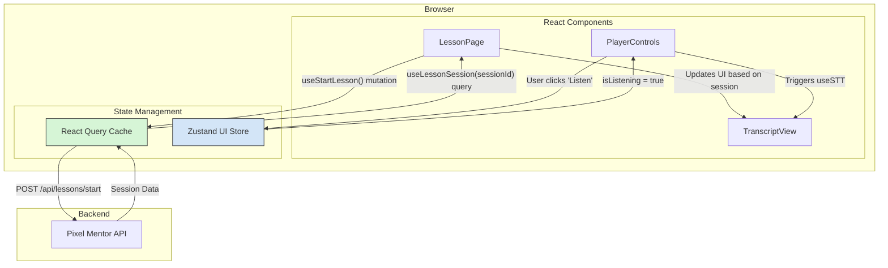

# Design: Frontend Audit and Refactoring

## Technical Approach

This design outlines the technical strategy for refactoring the frontend state management, voice hooks, and error handling. The approach is to systematically decouple state, modularize hooks, and standardize asynchronous operations.

1.  **State Management**: Server state (data fetched from the API) will be exclusively managed by TanStack Query (React Query). Global UI state (state related to the user interface that needs to be shared across components) will be managed by Zustand. Component-local state will remain in `useState`.
2.  **Voice Hooks**: The monolithic `useVoice` hook will be broken down into two specialized hooks: `useTTS` for Text-to-Speech and `useSTT` for Speech-to-Text. The existing `useVoice` hook will become a lightweight orchestrator, composing the new hooks to maintain backward compatibility.
3.  **Error Handling**: A standardized hook, `useAsyncState`, will be implemented to wrap all API interactions. This will provide a consistent way to handle loading, data, error states, and retries, integrating with a toast notification system for user feedback.

## Architecture Decisions

### Decision: State Management Segregation

- **Choice**: Use React Query for server state and Zustand for global UI state.
- **Alternatives considered**:
  - Continuing to use Zustand for all state: This leads to a complex, monolithic store that mixes concerns, making it hard to manage caching, refetching, and server state synchronization.
  - Using Redux Toolkit with RTK Query: While a powerful alternative, React Query is more lightweight and already established as a best practice for server state in the React ecosystem. The learning curve is also gentler for the team.
- **Rationale**: This separation of concerns is a standard best practice. React Query is purpose-built for managing server state, providing caching, automatic refetching, and stale-while-revalidate logic out of the box. Zustand is excellent for lightweight, manageable global UI state without the boilerplate of other solutions.

### Decision: `useVoice` Hook Decomposition

- **Choice**: Refactor `useVoice` into `useTTS`, `useSTT`, and a `useVoice` orchestrator.
- **Alternatives considered**:
  - Refactoring `useVoice` in place: This would involve cleaning up the existing 800-line file but would not solve the core problem of it having multiple responsibilities (TTS and STT).
- **Rationale**: Decomposing the hook follows the Single Responsibility Principle. `useTTS` can be used independently wherever speech synthesis is needed, and `useSTT` can be used for any speech recognition task. This improves modularity, reusability, and testability. The orchestrator pattern ensures that existing components using `useVoice` do not break.

## Data Flow

### Lesson State Data Flow

The new data flow for the lesson feature will be as follows:



**Flow Description:**

1.  A component calls a React Query mutation (e.g., `useStartLesson`).
2.  React Query handles the API call, including loading and error states.
3.  Upon success, the API response is stored in the React Query cache.
4.  Components use React Query hooks (e.g., `useLessonSession`) to subscribe to this cached data and re-render when it changes.
5.  UI-specific state (e.g., `isStreaming`, `isListening`) is managed in the `lessonUiStore` (Zustand). Components can subscribe to this store for UI-only updates.

## File Changes

| File                                                       | Action     | Description                                                                                                                                |
| ---------------------------------------------------------- | ---------- | ------------------------------------------------------------------------------------------------------------------------------------------ |
| `apps/web/src/features/lesson/stores/lesson.store.ts`      | **Modify** | Remove all server state (e.g., `lessonId`, `sessionId`, `config`, `accuracy`). Rename to `lesson-ui.store.ts`. Keep only UI-related state. |
| `apps/web/src/features/lesson/hooks/use-lesson-queries.ts` | **Create** | New file to house all React Query hooks related to lessons (`useLessonSession`, `useStartLesson`, `useInteractLesson`).                    |
| `apps/web/src/features/voice/hooks/useTTS.ts`              | **Create** | New hook containing all Text-to-Speech logic extracted from `useVoice`.                                                                    |
| `apps/web/src/features/voice/hooks/useSTT.ts`              | **Create** | New hook containing all Speech-to-Text logic extracted from `useVoice`.                                                                    |
| `apps/web/src/features/voice/hooks/useVoice.ts`            | **Modify** | Refactor to be a thin orchestrator that imports and uses `useTTS` and `useSTT`, maintaining its existing public interface.                 |
| `apps/web/src/hooks/useAsyncState.ts`                      | **Create** | New generic hook for wrapping asynchronous functions to manage state transitions (loading, error, data).                                   |
| `apps/web/src/providers/AppProviders.tsx`                  | **Modify** | Add `QueryClientProvider` to the application's provider tree.                                                                              |
| Various component files                                    | **Modify** | Update components that currently use `useLessonStore` to get server data, to now use the new React Query hooks.                            |

## Interfaces / Contracts

### 1. Lesson State

**Zustand UI Store (`lesson-ui.store.ts`)**

```typescript
interface LessonUIState {
  isStarting: boolean;
  error: string | null;
  retryCount: number;
  streamingChunks: string[];
  isStreaming: boolean;
  streamError: string | null;

  // Actions
  setIsStarting: (isStarting: boolean) => void;
  setError: (error: string | null) => void;
  // ... other UI-related actions
}
```

**React Query Hooks (`use-lesson-queries.ts`)**

```typescript
// Fetches the current state of a lesson session
function useLessonSession(sessionId: string | null): UseQueryResult<SessionData, Error>;

// Starts a new lesson
function useStartLesson(): UseMutationResult<SessionData, Error, { lessonId: string }>;

// Sends an interaction (e.g., student's answer)
function useInteractLesson(
  sessionId: string | null,
): UseMutationResult<InteractionResponse, Error, { text: string }>;
```

### 2. Voice Hooks

**`useTTS.ts`**

```typescript
interface UseTTSResult {
  isSpeaking: boolean;
  error: string | null;
  speak: (text: string, voiceSettings?: VoiceSettings) => Promise<boolean>;
  stopSpeaking: () => void;
  getCurrentAudioElement: () => HTMLAudioElement | null;
}
```

**`useSTT.ts`**

```typescript
interface UseSTTResult {
  isListening: boolean;
  transcript: string;
  confidence: number;
  error: string | null;
  isSupported: boolean;
  startListening: () => void;
  stopListening: () => void;
  clearTranscript: () => void;
}
```

### 3. Error Handling

**`useAsyncState.ts`**

```typescript
interface AsyncState<T> {
  isLoading: boolean;
  data: T | null;
  error: Error | null;
}

interface UseAsyncStateResult<T, A extends any[]> extends AsyncState<T> {
  execute: (...args: A) => Promise<T | undefined>;
  reset: () => void;
}

function useAsyncState<T, A extends any[]>(
  asyncFn: (...args: A) => Promise<T>,
  options?: {
    onSuccess?: (data: T) => void;
    onError?: (error: Error) => void;
  },
): UseAsyncStateResult<T, A>;
```

The `onError` callback will be used to trigger toast notifications.

## Testing Strategy

| Layer           | What to Test                                                                                                              | Approach                                                                                                                                |
| --------------- | ------------------------------------------------------------------------------------------------------------------------- | --------------------------------------------------------------------------------------------------------------------------------------- |
| **Unit**        | - `lesson-ui.store.ts`: Actions correctly modify the state.                                                               | `jest` and `@testing-library/react`. Test Zustand actions by calling them and asserting on the resulting state.                         |
|                 | - `useTTS` / `useSTT`: Hooks manage their internal state correctly. Mock external dependencies (`SpeechSynthesis`, etc.). | `jest` and `@testing-library/react`. Use `renderHook` to test hook logic in isolation.                                                  |
|                 | - `useAsyncState`: Correctly transitions between loading, data, and error states.                                         | `jest` and `@testing-library/react`. Pass mock async functions (that resolve or reject) and assert the hook's returned state.           |
| **Integration** | - Components correctly fetch data using React Query hooks and render the UI.                                              | `jest`, `msw` (Mock Service Worker), `@testing-library/react`. Mock API endpoints with `msw` and test that components render correctly. |
|                 | - `useVoice` orchestrator correctly combines `useTTS` and `useSTT`.                                                       | `@testing-library/react`. Render a test component using `useVoice` and verify that TTS and STT functionalities are triggered correctly. |

## Migration / Rollout

This is a significant refactoring of core frontend infrastructure. The implementation will be phased to minimize risk.

1.  **Phase 1: Foundational Setup**: Introduce React Query and `useAsyncState`. Set up the `QueryClientProvider`.
2.  **Phase 2: `useVoice` Refactor**: Create `useTTS` and `useSTT`, and refactor `useVoice`. Since `useVoice` maintains its public API, this should not require immediate changes in consumer components.
3.  **Phase 3: Lesson State Refactor**: Create the new lesson query hooks and refactor the `lesson.store.ts` into `lesson-ui.store.ts`. This is the most invasive step and will require updating all components that interact with lesson state.

Feature flags are not required as this is a code-level refactoring, not a user-facing feature change. The phased approach will act as a control mechanism.

## Open Questions

- [ ] Are there any other stores besides `lesson.store.ts` that mix server and UI state and should be included in the scope of this refactoring?
- [ ] What is the preferred toast notification library to integrate with `useAsyncState`? (`react-hot-toast`, `sonner`, etc.)
